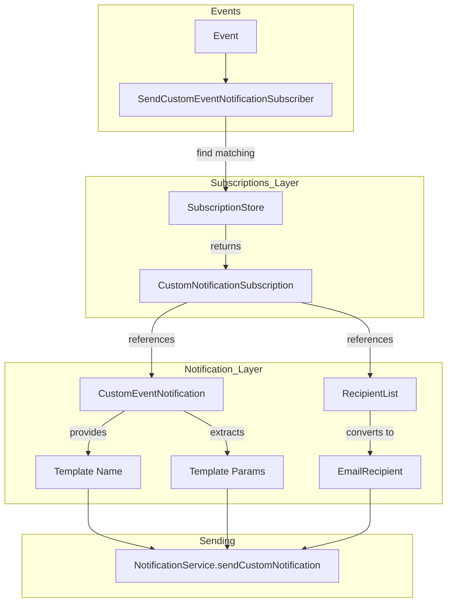

# Custom Notifications Implementation Plan

This document outlines the implementation plan for the custom mail notifications feature based on the high-level design in [`docs/Custom Notifications.md`](../docs/Custom%20Notifications.md).

## Overview

The feature enables sending custom email notifications to editable lists of users when specific events occur. The system consists of:

1. **CustomEventNotification** - Defines what notification to send (template + params extraction)
2. **CustomNotificationRecipientList** - Defines who receives the notification (stored in DB, managed via UI)
3. **CustomNotificationSubscription** - Links custom notifications to recipient lists, also allowing to set the resource address wildcard (stored in DB, managed via UI)
4. **SendCustomEventNotificationSubscriber** - EventSubscriber that processes events and sends notifications

## Architecture



## Implementation Steps

### Phase 1: Core Interfaces and Models

#### 1.1 Create CustomEventNotification interface

**Location:** `backend-apps/notifications/src/main/kotlin/cz/sentica/qwazar/notifications/models/CustomEventNotification.kt`

```kotlin
typealias CustomEventNotificationId = String

interface CustomEventNotification {
    val id: CustomEventNotificationId
    val name: String
    val description: String
    val eventType: EventType
    val templateName: String

    fun templateParamsFor(event: Event): TemplateParams
}
```

The interface pattern follows existing [`NotificationEmailTemplate`](../backend-apps/integration/src/main/kotlin/cz/sentica/qwazar/integration/templates/NotificationEmailTemplates.kt:25) which also pairs event types with templates.

#### 1.2 Create CustomEventNotificationRegistry

**Location:** `backend-apps/notifications/src/main/kotlin/cz/sentica/qwazar/notifications/services/CustomEventNotificationRegistry.kt`

A service class that holds all registered `CustomEventNotification` implementations and allows lookup by ID. Pattern similar to [`BackgroundJobRegistry`](../backend-apps/background-jobs/src/main/kotlin/cz/sentica/qwazar/backgroundJobs/services/BackgroundJobRegistry.kt).

```kotlin
class CustomEventNotificationRegistry {
    private val notifications = mutableMapOf<CustomEventNotificationId, CustomEventNotification>()
    
    fun register(notification: CustomEventNotification) {
        notifications[notification.id] = notification
    }
    
    fun getById(id: CustomEventNotificationId): CustomEventNotification?
    fun getAll(): List<CustomEventNotification>
    fun getByEventType(eventType: EventType): List<CustomEventNotification>
}
```

---

### Phase 2: Recipient List Management

#### 2.1 Create database entity for recipient lists

**Location:** `backend-apps/notifications/src/main/kotlin/cz/sentica/qwazar/notifications/models/CustomNotificationRecipientList.kt`

**Table name:** `custom_notification_recipient_list`

```kotlin
@Entity
@Table(name = "custom_notification_recipient_list")
class DatabaseCustomNotificationRecipientList(
    @Id val id: String = UUID.randomUUID().toString(),
    var name: String,
    var description: String? = null,
    
	@DbArray
    @Column
    var toAddresses: List<String>,
    
	@DbArray
    @Column
    var ccAddresses: List<String> = emptyList(),
    
	@DbArray
    @Column
    var bccAddresses: List<String> = emptyList(),
) : Model() {
    fun toEmailRecipient(): EmailRecipient
}
```

Pattern follows [`DatabaseNotificationSetting`](../backend-apps/notifications/src/main/kotlin/cz/sentica/qwazar/notifications/models/NotificationSetting.kt).

#### 2.2 Create repository for recipient lists

**Location:** `backend-apps/notifications/src/main/kotlin/cz/sentica/qwazar/notifications/repositories/CustomNotificationRecipientListRepository.kt`

Standard Ebean repository following existing patterns.

#### 2.3 Create store interface and make the repository implement it

Pattern follows [`NotificationSettingStore`](../backend-apps/events/src/main/kotlin/cz/sentica/events/notifications/stores/DatabaseEventStore.kt), but without the generic type param on the store inteface.

#### 2.4 Create Artifact wrapper for recipient lists

**Location:** `backend-apps/admin/src/main/kotlin/cz/sentica/qwazar/admin/customNotifications/recipientLists/RecipientListArtifact.kt`

Pattern follows [`RoleArtifact`](../backend-apps/admin/src/main/kotlin/cz/sentica/qwazar/admin/roles/RoleArtifact.kt).

```kotlin
class RecipientListArtifact(
    entity: DatabaseCustomNotificationRecipientList,
    manager: RecipientListManager,
) : DatabaseArtifact<DatabaseCustomNotificationRecipientList>(manager, entity) {
    override val label: String
        get() = name

    var name by delegatingStringSlot(DatabaseCustomNotificationRecipientList::name)
    var description by nullableDelegatingStringSlot(DatabaseCustomNotificationRecipientList::description)
    // Email lists as multi-value slots or custom handling
}
```

#### 2.5 Create Manager, Registry, and ViewSet for recipient lists

**Location:** `backend-apps/admin/src/main/kotlin/cz/sentica/qwazar/admin/customNotifications/recipientLists/`

Files needed:
- `RecipientListManager.kt` - Following [`RoleManager`](../backend-apps/admin/src/main/kotlin/cz/sentica/qwazar/admin/roles/RoleManager.kt)
- `RecipientListRegistry.kt` - Following [`RoleRegistry`](../backend-apps/admin/src/main/kotlin/cz/sentica/qwazar/admin/roles/RoleRegistry.kt)
- `RecipientListViewSet.kt` - Following [`RoleViewSet`](../backend-apps/admin/src/main/kotlin/cz/sentica/qwazar/admin/roles/RoleViewSet.kt)
- `RecipientListListRenderer.kt` - Following [`RoleListRenderer`](../backend-apps/admin/src/main/kotlin/cz/sentica/qwazar/admin/roles/RoleListRenderer.kt)
- `RecipientListCreateRenderer.kt`
- `RecipientListDetailRenderer.kt`
- `RecipientListSecurityRules.kt`

---

### Phase 3: Subscription Management

#### 3.1 Create database entity for subscriptions

**Location:** `backend-apps/notifications/src/main/kotlin/cz/sentica/qwazar/notifications/models/CustomNotificationSubscription.kt`

**Table name:** `custom_notification_subscription`

```kotlin
@Entity
@Table(name = "custom_notification_subscription")
class DatabaseCustomNotificationSubscription(
    @Id val id: String = UUID.randomUUID().toString(),
    
    // Event matching
    var eventType: String,  // EventType.name
    var resourceAddressWildcard: String,  // Address serialized as string
    
    // Reference to CustomEventNotification (by ID, looked up in registry)
    var notificationId: String,
    
    // Reference to recipient list
    @ManyToOne
    var recipientList: DatabaseCustomNotificationRecipientList,
    
    // Optional metadata
    var name: String? = null,
    var description: String? = null,
    var enabled: Boolean = true,
) : Model()
```

#### 3.2 Create repository for subscriptions

**Location:** `backend-apps/notifications/src/main/kotlin/cz/sentica/qwazar/notifications/repositories/CustomNotificationSubscriptionRepository.kt`

Important method:
```kotlin
fun findByEventType(eventType: EventType): List<DatabaseCustomNotificationSubscription>
```

#### 3.3 Create store interface and implementation

**Location:** `backend-apps/notifications/src/main/kotlin/cz/sentica/qwazar/notifications/stores/CustomNotificationSubscriptionStore.kt`

Key method following the pattern in [`NotificationSettingStore.getImmediateFor()`](../backend-apps/notifications/src/main/kotlin/cz/sentica/qwazar/notifications/stores/NotificationSettingStore.kt:53-58):

```kotlin
fun getMatchingSubscriptions(event: Event): List<DatabaseCustomNotificationSubscription> {
    return repository
        .findByEventType(event.type)
        .filter { it.enabled }
        .filter { 
            Address.parse(it.resourceAddressWildcard) incorporates event.resourceAddress 
        }
}
```

#### 3.4 Create Artifact wrapper for subscriptions

**Location:** `backend-apps/admin/src/main/kotlin/cz/sentica/qwazar/admin/customNotifications/subscriptions/SubscriptionArtifact.kt`

This artifact needs special handling for:
- `notificationId` - Select from registered `CustomEventNotification`s (dropdown populated from registry)
- `recipientList` - Select from existing recipient lists (relationship to another artifact)
- `resourceAddressWildcard` - Address input with wildcard support

#### 3.5 Create Manager, Registry, and ViewSet for subscriptions

**Location:** `backend-apps/admin/src/main/kotlin/cz/sentica/qwazar/admin/customNotifications/subscriptions/`

Files needed:
- `SubscriptionManager.kt`
- `SubscriptionRegistry.kt`
- `SubscriptionViewSet.kt`
- `SubscriptionListRenderer.kt`
- `SubscriptionCreateRenderer.kt`
- `SubscriptionDetailRenderer.kt`
- `SubscriptionSecurityRules.kt`

---

### Phase 4: Event Subscriber Implementation

#### 4.1 Create SendCustomEventNotificationSubscriber

**Location:** `backend-apps/notifications/src/main/kotlin/cz/sentica/qwazar/notifications/services/SendCustomEventNotificationSubscriber.kt`

Pattern follows [`CreateArtifactEventSubscriber`](../backends/kb/presentation-base/src/main/kotlin/cz/sentica/qwazar/kb/utils/eventSubscribers/CreateArtifactEventSubscriber.kt) and the existing [`NotificationService`](../backend-apps/notifications/src/main/kotlin/cz/sentica/qwazar/notifications/services/NotificationService.kt:87-106).

```kotlin
class SendCustomEventNotificationSubscriber(
    private val subscriptionStore: CustomNotificationSubscriptionStore,
    private val notificationRegistry: CustomEventNotificationRegistry,
    private val notificationService: NotificationService,
) : EventSubscriber {
    
    // Subscribe to all event types that have registered CustomEventNotifications
    override val subscribedEventTypes: List<EventType>
        get() = notificationRegistry.getAll().map { it.eventType }.distinct()

    override fun processEvent(event: Event): EventProcessingResult {
        return try {
            val matchingSubscriptions = subscriptionStore.getMatchingSubscriptions(event)
            
            matchingSubscriptions.forEach { subscription ->
                val notification = notificationRegistry.getById(subscription.notificationId)
                    ?: return@forEach // skip if notification not found
                
                val templateParams = notification.templateParamsFor(event)
                val recipient = subscription.recipientList.toEmailRecipient()
                
                notificationService.sendCustomNotification(
                    type = NotificationType.Mail,
                    recipient = recipient,
                    templateName = notification.templateName,
                    templateParams = templateParams,
                )
            }
            
            EventProcessingResult(EventProcessingResultCode.Success)
        } catch (e: RuntimeException) {
            EventProcessingResult(EventProcessingResultCode.NonBlockingError, e)
        }
    }
}
```

---

### Phase 5: Configuration and Registration

#### 5.1 Create configuration class for custom notifications

**Location:** `backend-apps/notifications/src/main/kotlin/cz/sentica/qwazar/notifications/configuration/CustomNotificationConfiguration.kt`

This configuration will:
- Create beans for stores and registry
- Register the `SendCustomEventNotificationSubscriber` as an `EventSubscriber`

Pattern follows [`EnterpriseCapabilityModelEventSubscriberConfiguration`](../backends/kb/modules-unextracted/src/main/kotlin/cz/sentica/qwazar/kb/modules/enterpriseCapabilityModel/configuration/EnterpriseCapabilityModelEventSubscriberConfiguration.kt).

#### 5.2 Create admin configuration for UI components

**Location:** `backend-apps/admin/src/main/kotlin/cz/sentica/qwazar/admin/customNotifications/CustomNotificationAdminConfiguration.kt`

This configuration will:
- Create beans for managers, registries, and viewsets
- Register the viewsets for navigation

---

### Phase 6: Testing

#### 6.1 Unit tests for CustomEventNotificationRegistry

Test registration, lookup by ID, and lookup by event type.

#### 6.2 Unit tests for stores

Test CRUD operations and subscription matching logic (especially address wildcard matching).

#### 6.3 Integration tests for SendCustomEventNotificationSubscriber

Test end-to-end flow: event → subscription matching → notification sending.

#### 6.4 UI tests (optional)

Test CRUD operations for recipient lists and subscriptions via the admin UI.

---

## File Structure Summary

```text
backend-apps/notifications/src/main/kotlin/cz/sentica/qwazar/notifications/
├── models/
│   ├── CustomEventNotification.kt           # Interface
│   ├── CustomNotificationRecipientList.kt   # DB entity
│   └── CustomNotificationSubscription.kt    # DB entity
├── repositories/
│   ├── CustomNotificationRecipientListRepository.kt
│   └── CustomNotificationSubscriptionRepository.kt
├── stores/
│   ├── CustomNotificationRecipientListStore.kt
│   └── CustomNotificationSubscriptionStore.kt
├── services/
│   ├── CustomEventNotificationRegistry.kt
│   └── SendCustomEventNotificationSubscriber.kt
└── configuration/
    └── CustomNotificationConfiguration.kt

backend-apps/admin/src/main/kotlin/cz/sentica/qwazar/admin/customNotifications/
├── recipientLists/
│   ├── RecipientListArtifact.kt
│   ├── RecipientListManager.kt
│   ├── RecipientListRegistry.kt
│   ├── RecipientListViewSet.kt
│   ├── RecipientListListRenderer.kt
│   ├── RecipientListCreateRenderer.kt
│   ├── RecipientListDetailRenderer.kt
│   └── RecipientListSecurityRules.kt
├── subscriptions/
│   ├── SubscriptionArtifact.kt
│   ├── SubscriptionManager.kt
│   ├── SubscriptionRegistry.kt
│   ├── SubscriptionViewSet.kt
│   ├── SubscriptionListRenderer.kt
│   ├── SubscriptionCreateRenderer.kt
│   ├── SubscriptionDetailRenderer.kt
│   └── SubscriptionSecurityRules.kt
└── CustomNotificationAdminConfiguration.kt
```

## Implementation Order (Recommended)

The implementation should follow this dependency order:

1. **Phase 1** - Core interfaces (no dependencies)
2. **Phase 2** - Recipient lists (depends on Phase 1 only for EmailRecipient)
3. **Phase 3** - Subscriptions (depends on Phase 1 and Phase 2)
4. **Phase 4** - Event subscriber (depends on all previous phases)
5. **Phase 5** - Configuration (wires everything together)
6. **Phase 6** - Testing (throughout development)

## Notes and Considerations

### Address Wildcard Matching

The existing [`incorporates`](../core/models/src/main/kotlin/cz/sentica/qwazar/domain/address/AddressExtensions.kt:148) function provides the wildcard matching capability needed for subscriptions. This is already used in [`NotificationSettingStore`](../backend-apps/notifications/src/main/kotlin/cz/sentica/qwazar/notifications/stores/NotificationSettingStore.kt:57) for similar filtering.

### Template Registration

Custom notification templates still need to be registered in [`NotificationTemplateConfiguration`](../backend-apps/integration/src/main/kotlin/cz/sentica/qwazar/integration/configuration/NotificationTemplateConfiguration.kt). The `CustomEventNotification.templateName` must reference a template that has been registered there.

### Performance Consideration

Subscription matching is done in-memory after filtering by event type in the database. For high-volume scenarios, consider adding database-level address prefix filtering.
